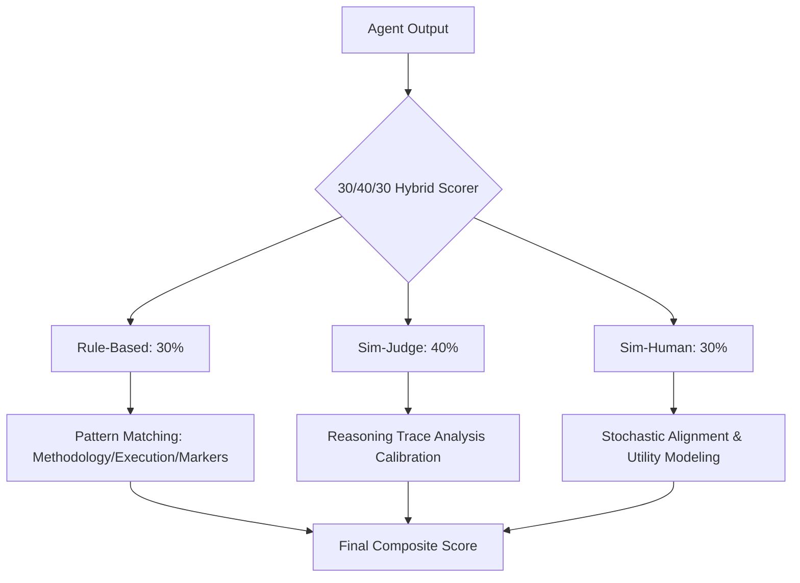

# 🏟️ Agent Arena: Framework Prototype & Simulation Study

[](file:///c:/Users/USER/Downloads/agentarena/tests/)
[](https://www.python.org/)
[](#-simulation-reproducibility)
[](file:///c:/Users/USER/Downloads/agentarena/LICENSE)

**Agent Arena** is a production-grade framework prototype designed for the quantified evaluation of autonomous AI agents. This repository implements the **Agent Arena Evaluation Strategy**, featuring a multi-dimensional structural scorer and a 100-task simulation study across 5 sophisticated domains.

> [!IMPORTANT]
> **Prototype Identity**: This repository is a **simulation environment** built to validate the Agent Arena evaluation methodology. The results are derived from **prototype agents** with calibrated performance profiles and structural rule-validation logic.

---

## 🧪 The 30/40/30 Hybrid Scoring Engine

Agent Arena moves beyond generic string-matching. Our `AgentArenaScorer` evaluates agentic performance through a three-layer validation stack:



| Component | Weight | Implementation | Evaluation Focus |
| :--- | :---: | :--- | :--- |
| **Rule-Based** | **30%** | **Hard Structural Checks** | Validation of required blocks (`Methodology:`, `Execution:`, `Confidence:`) |
| **Sim-Judge** | **40%** | **Qualitative Calibration** | Simulated depth of reasoning based on agent accurately profiling tool-chains. |
| **Sim-Human** | **30%** | **Alignment Simulation** | Modeled subjective utility and instructional following with standard variance. |

---

## 🤖 Subject Configurations (Agent Profiles)

The prototype benchmarks three core agent architectures, each with distinct calibrated performance targets:

*   **🏆 GPT-4 Agent Prototype** (Target: **82%**): Calibrated for high-fidelity planning and complex structural documentation.
*   **🥈 Claude-3 Agent Prototype** (Target: **79%**): Calibrated for nuanced reasoning chains and safety-first response markers.
*   **🥉 LangChain Agent Prototype** (Target: **61%**): Calibrated for deterministic but potentially rigid ReAct tool-loops.

---

## 🧬 Reproducibility & Statistical Convergence

To ensure the framework's behavior is scientifically verifiable, the following parameters are enforced:

- **100-Task Empirical Bank**: 20 deep-dive tasks per domain (Coding, Research, Planning, Logic, Data).
- **Structural Enforcement**: Agents *must* emit specific markers to achieve high Rule-Based scores.
- **Statistical Significance**: Convergence is validated across 100 simulation rounds in `simulation_study.py`.

---

## 🚀 Getting Started

### 1. Installation
```bash
git clone https://github.com/babureddynangi/agentarena.git
cd agentarena
pip install -r requirements.txt
```

### 2. Single Study Run
Run the core benchmark to see the framework evaluate the calibrated prototypes:
```bash
# Windows (supports Emojis)
$env:PYTHONIOENCODING='utf-8'; python main.py
```

### 3. Statistical Analysis
Run the multi-round convergence study to verify standard deviations and mean stability:
```bash
python simulation_study.py
```

---

## 🗺️ Framework Roadmap

Agent Arena is a living prototype. Future phases include:
- [ ] **Live API Integration**: Transitioning from calibration to live GPT-4/Claude-3 API calls.
- [ ] **Automated LLM-Judge**: Implementation of a real `JudgeAgent` using GPT-4o-mini for qualitative scoring.
- [ ] **Web Dashboard**: A React-based visualization layer for real-time leaderboard tracking.

---

## 📚 Citation

```text
@article{agentarena_prototype_2026,
  title={Agent Arena: A Framework Prototype for Autonomous Agent Evaluation},
  author={Reddy Nangi, Babureddy},
  year={2026}
}
```
